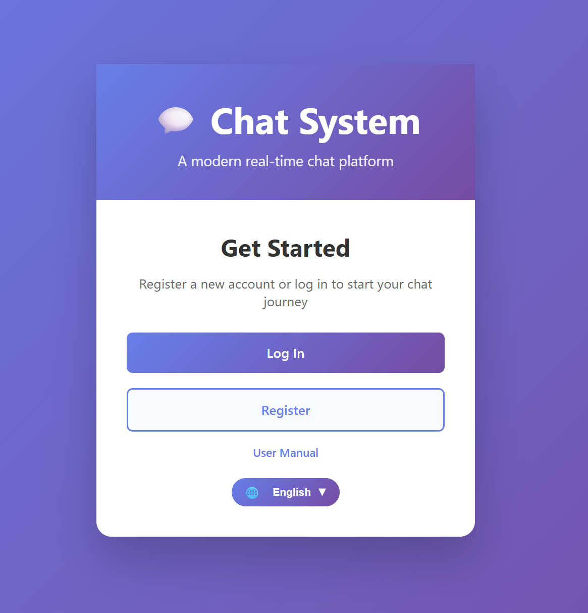
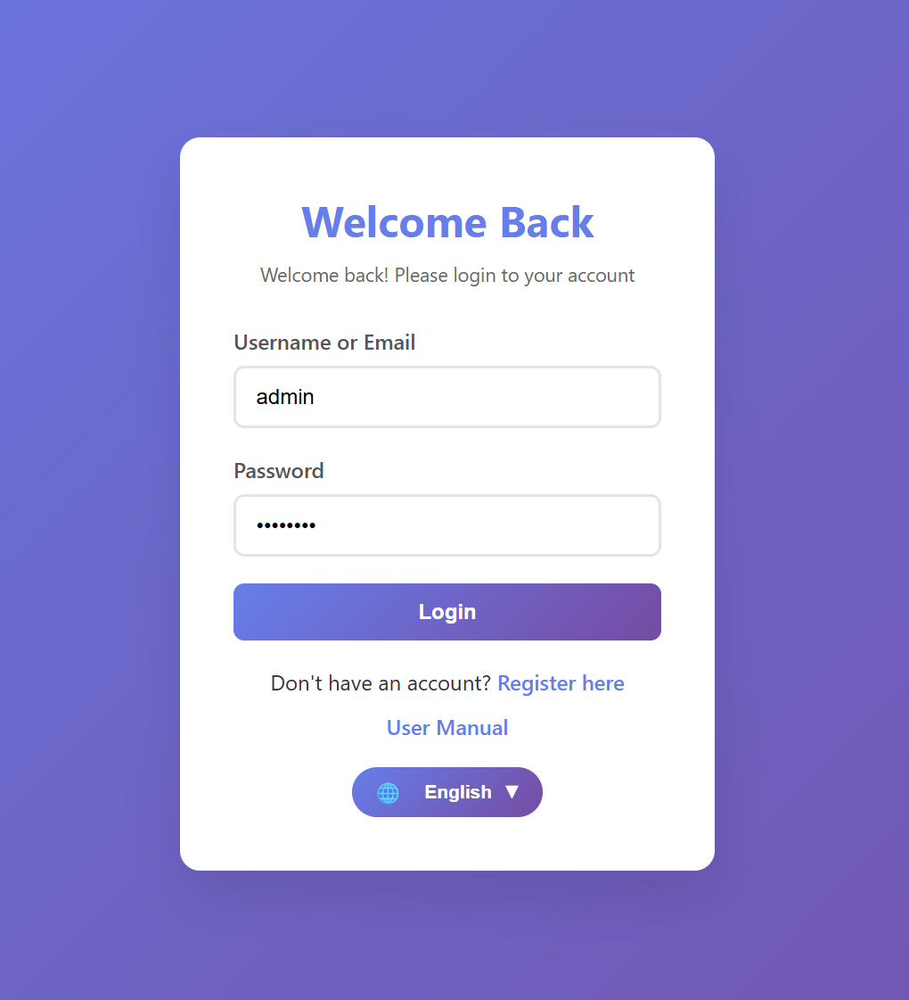
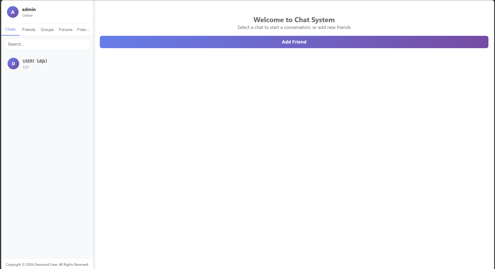
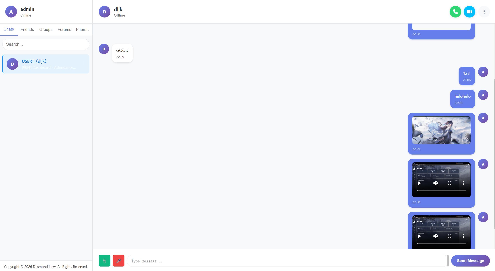
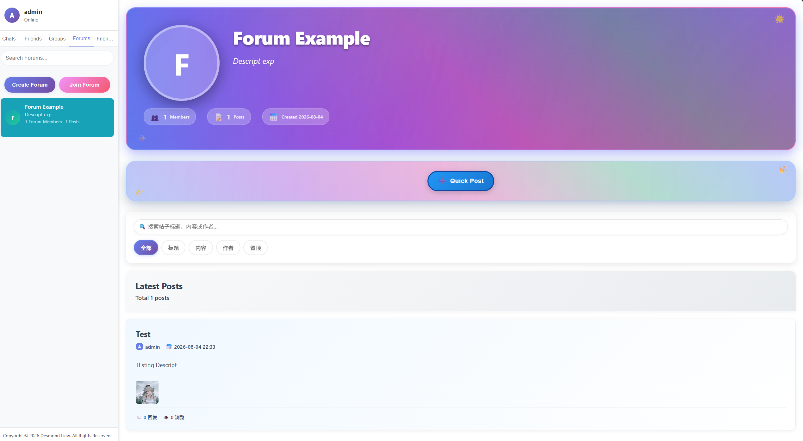
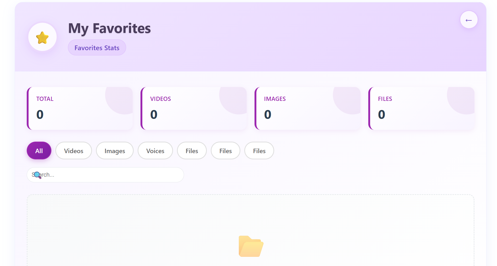
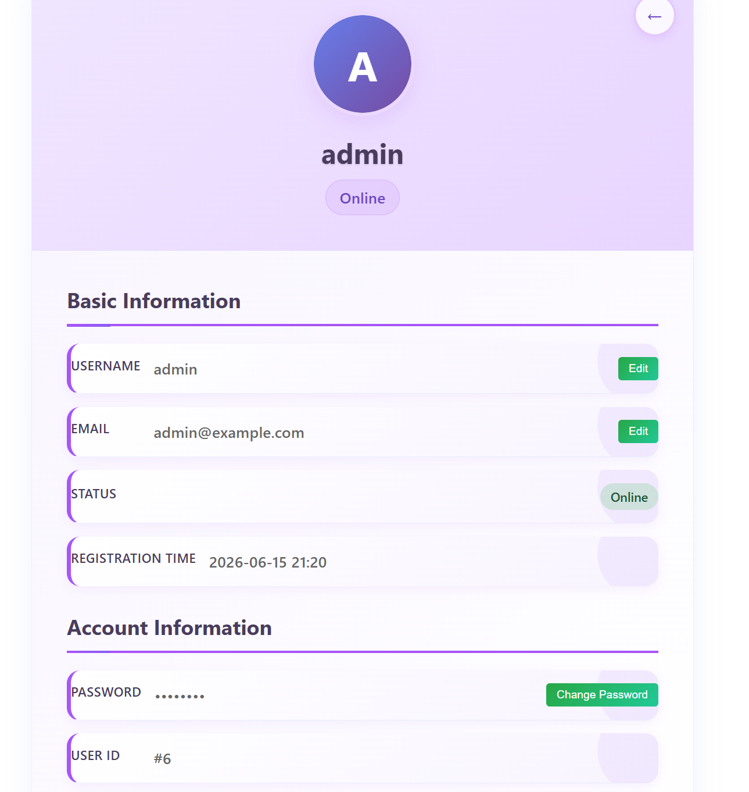

# 💬 Chat System

A modern real-time chat platform built with PHP, MySQL, and JavaScript — private & group messaging, forums, favorites, WebRTC voice/video calls, and multilingual UI (English / 中文 / Bahasa Melayu).

---

## ✨ Features

### 🔐 User Accounts & Profiles
Register and log in with username/email and password. Update your profile, upload an avatar, and manage online status from a personal profile page.

### 💬 Private & Group Chat
Start one-to-one chats with friends or create group rooms with member roles (member / admin / creator). Messages support text, images, files, voice notes, and video attachments, with edit, recall, delete, quote, pin, and forward actions.

### 👥 Friends & Blocking
Search users, send/accept/reject friend requests, set friend nicknames, and block or unblock users from a dedicated blocked list.

### 📞 Voice & Video Calls (WebRTC)
Place and answer voice or video calls from a chat room. Signaling is handled by the PHP app; WebRTC uses STUN (and optional TURN) for NAT traversal. On shared hosting, use **HTTPS** so the browser can access the microphone and camera. Cross-network calls (e.g. phone ↔ PC) usually need a TURN server — see `docs/VOICE_CALL_CPANEL.md` and `config/call-config.php`.

### 📰 Forums
Create public or private forums, invite or approve members, and publish posts with attachments. Pin, lock, like, and comment on posts from the forum views.

### ⭐ Favorites
Save important messages (text, images, videos, files, links) to a personal favorites library and browse them by type.

### 🌐 Multilingual UI & User Manual
Switch language between English, Chinese, and Malay. An in-app User Manual (`help.php`) follows the current interface language.

---

## 🏗️ Tech Stack

| Category | Technology |
|---|---|
| 🖥️ Frontend | HTML5, CSS3, JavaScript (AJAX / Fetch) |
| 🔙 Backend | PHP (MVC-style controllers, models, views) |
| 🗄️ Database | MySQL (required) |
| 📞 Real-time calls | WebRTC + PHP signaling (`signaling-server.php`) |
| 🏠 Local Server | XAMPP (Apache + MySQL) |
| ☁️ Hosting | Shared hosting friendly (e.g. iFastNet) |

---

## 📁 Project Structure

```
Chat_System/
├── index.php
├── help.php
├── .htaccess
├── app/
│   ├── controllers/
│   ├── models/
│   └── views/
│       ├── auth/
│       ├── chat/
│       ├── dashboard/
│       ├── forum/
│       ├── help/
│       ├── profile/
│       └── components/
├── assets/
│   └── screenshots/
├── config/
│   ├── Database.php
│   ├── call-config.php
│   ├── complete_database.sql
│   └── database.sql
├── core/
│   ├── router.php
│   └── session.php
├── docs/
├── lang/
│   ├── en.php
│   ├── zh.php
│   ├── ms.php
│   └── manual/
├── public/
│   ├── css/
│   ├── js/
│   └── uploads/
├── storage/
│   └── sessions/
├── signaling-server.php
└── README.md
```

---

## ⬇️ Download & Run on Localhost

1. Download this project from GitHub:  
   **[Code → Download ZIP](https://github.com/dljk0927prog/CHATTING)**  
   or clone:
   ```bash
   git clone https://github.com/dljk0927prog/CHATTING.git
   ```
2. Extract the ZIP (if downloaded), then rename the folder to `Chat_System`.
3. Put the folder into XAMPP:
   ```
   C:\xampp\htdocs\Chat_System\
   ```
4. Open **XAMPP Control Panel** and start **Apache** and **MySQL**.
5. Create a MySQL database named `chatting_system`, then import `config/complete_database.sql` in phpMyAdmin.  
   Set DB host / name / user / password in `config/Database.php` if needed (defaults: `localhost`, `chatting_system`, `root`, empty password).
6. Open your browser and go to:
   ```
   http://localhost/Chat_System/
   ```

That’s it — you can register an account and start chatting.

> **iFastNet / shared hosting tip:** create the database in cPanel first, select it in phpMyAdmin, then import `config/complete_database.sql`. If `CREATE DATABASE` fails on shared hosting, skip or comment that line and import the tables only. Update `config/Database.php` with your cPanel DB credentials. For voice/video calls, serve the site over **HTTPS**.

---

## 🚀 How to Use the System

### 1) Register & log in
1. Open the welcome page and choose **Register** or **Log In**.
2. After login you land on the **Dashboard** with Chats, Friends, Groups, Forums, Favorites, and Profile.

### 2) Chat with friends
1. Add friends from the Friends tab (search → send request → accept).
2. Open a private chat room and send text, images, files, or voice notes.
3. Use the message actions bar to edit, recall, pin, favorite, quote, or forward.

### 3) Groups & forums
1. Create a group chat, invite members, and manage roles in group settings.
2. Open **Forums**, create or join a forum, then write posts and comments.

### 4) Voice / video call
1. Open a chat room and start a **Voice** or **Video** call.
2. Allow microphone (and camera for video) when the browser asks.
3. Answer or decline incoming call invitations from the other user.
4. On production hosting, use HTTPS; for phone ↔ PC across networks, configure TURN in `config/call-config.php`.

### 5) Favorites, profile & help
- Star messages to save them under **Favorites**.
- Update username/avatar under **Profile**.
- Open **User Manual** (`help.php`) for language-matched help.

---

## 🖼️ Project Screenshots

Camera / live call preview screens are omitted here for privacy. Call behavior is described under Features and How to Use.

| Welcome | Login |
|---|---|
|  |  |

| Dashboard | Chat Room |
|---|---|
|  |  |

| Forum | Favorites |
|---|---|
|  |  |

| Profile |
|---|
|  |

---

## 🎬 Demo Video

Demo video coming soon.

---

## 📺 Demo / Links

| Resource | Link |
|---|---|
| 🌐 Live URL | [desmondliewjiankai.kolejsynergy.com/Chat_System](https://desmondliewjiankai.kolejsynergy.com/Chat_System/) |
| 💻 Local (XAMPP) | `http://localhost/Chat_System/` |
| 📦 GitHub Repository | [dljk0927prog/CHATTING](https://github.com/dljk0927prog/CHATTING) |

---

## ✅ Quick Test Plan

- [ ] Register a new user and log in
- [ ] Add a friend and send a private text / image / file message
- [ ] Create a group, invite a member, and pin a message
- [ ] Create a forum post with an attachment and leave a comment
- [ ] Favorite a message and find it under Favorites
- [ ] Switch language (EN / 中文 / MS) and open the User Manual
- [ ] (Optional) Start a voice call on localhost with two browser sessions

---

## 📄 License / Copyright

Copyright © 2026 Desmond Liew. All Rights Reserved.

---

⭐ If this project helps you, please star the repository!  
✨ Feel free to explore, fork, and improve it.
